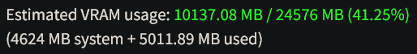

# VRAM Estimator for stable-diffusion-webui

When using stable-diffusion-webui, if you find yourself frequently running out of VRAM or worried that pushing your settings too far will break your webui, this extension might be of use. It gathers a set of statistics based on running `txt2img` and `img2img` with various different settings and uses extrapolation to estimate the amount of VRAM your settings will use.

## Usage

First you will need to gather some data from running a bunch of image generations for the extension to use (you'll only have to do this step once). Go to the `VRAM Estimator` tab and set the `Max Image Size` and `Max Batch Count` parameters to the maximum that your system can handle when generating with `txt2img` and Hires Fix enabled (Hires Fix uses more VRAM than plain `txt2img` even when the target resolution is the same). The default settings of size 960 and 8 batch count are appropriate for an RTX 3090. Make sure you've closed any other programs that can take up VRAM, then click `Run Benchmark` and watch the console for progress. The benchmark will generate several images at different resolutions with `txt2img` and `img2img` and save the VRAM used by each run.

After the benchmark has finished, you can go to the `txt2img` or `img2img` tab and adjust the sliders for Width/Height/Hires Fix to see the estimated VRAM usage. Note that the estimate is based on the amount of used VRAM on your system at the time you change the slider. As a rule of thumb you should expect about 1 GB more of VRAM to actually be used by the generating operation you choose.

Also note that this extension does not take into account VRAM allocated by other extensions like ControlNet; it only looks at the width, height and batch count of the vanilla generation config. If you update webui, it's worth running the benchmark again if you find the estimates are no longer accurate.
